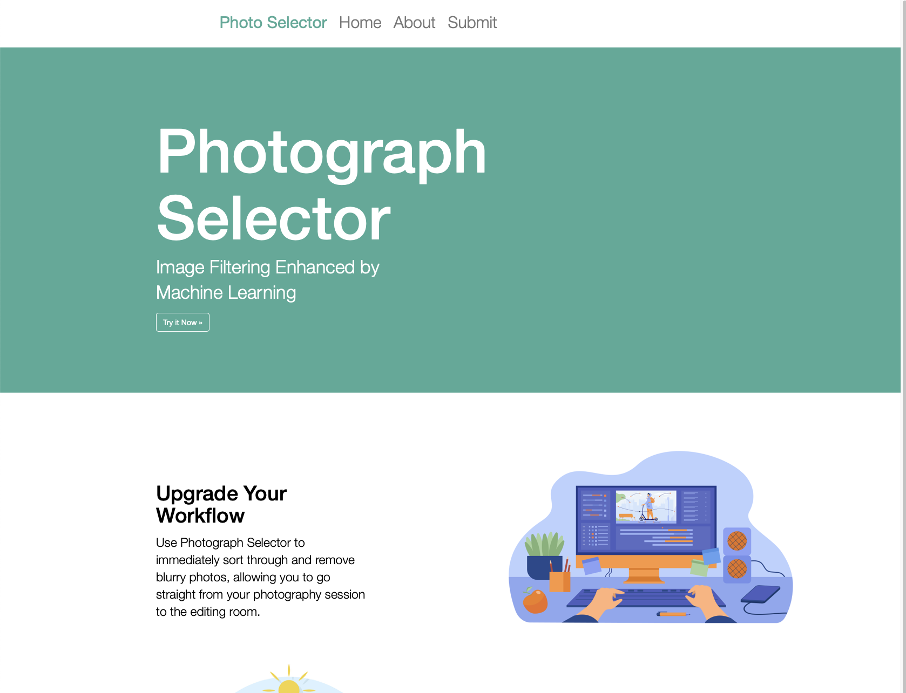
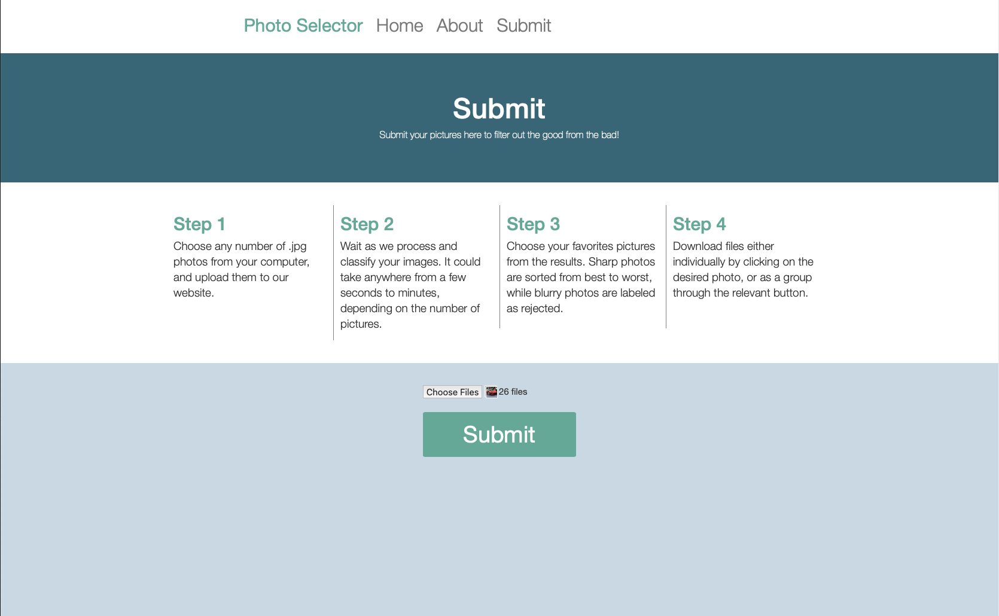
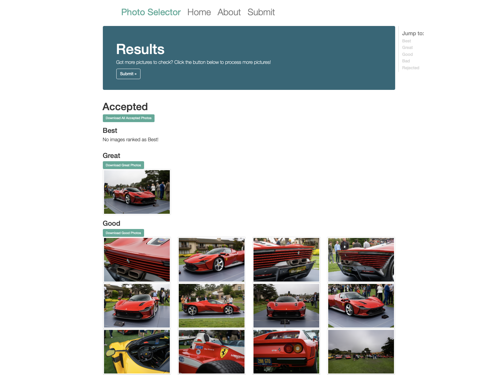

# Photograph Selector
Photograph Selector is a web app used to streamline photography workflow by sorting and rating images based on aesthetic and blurriness. 

## How it works
To determine if an image is blurry, the variance of the laplacian of each image is calcualted, and compared to a threshold to determine if the image is blurry or not.
The aesthetic value of an image is determined by a machine learning model based on the ReLIC architecture, which is trained on the AVA dataset to
learn what people consider to be aesthetic images.  

Upon uploading images, users can observe the sorted photos, and also download the sorted photos to their computer. 

## Preview
Home Page:  
    
Submit Page:  
    
Results Page:  
  

## TODO
* Add slider to choose sensitivity of filter to blurriness
* Preview images to be submitted on submit page
* Add compatibility for other image types

